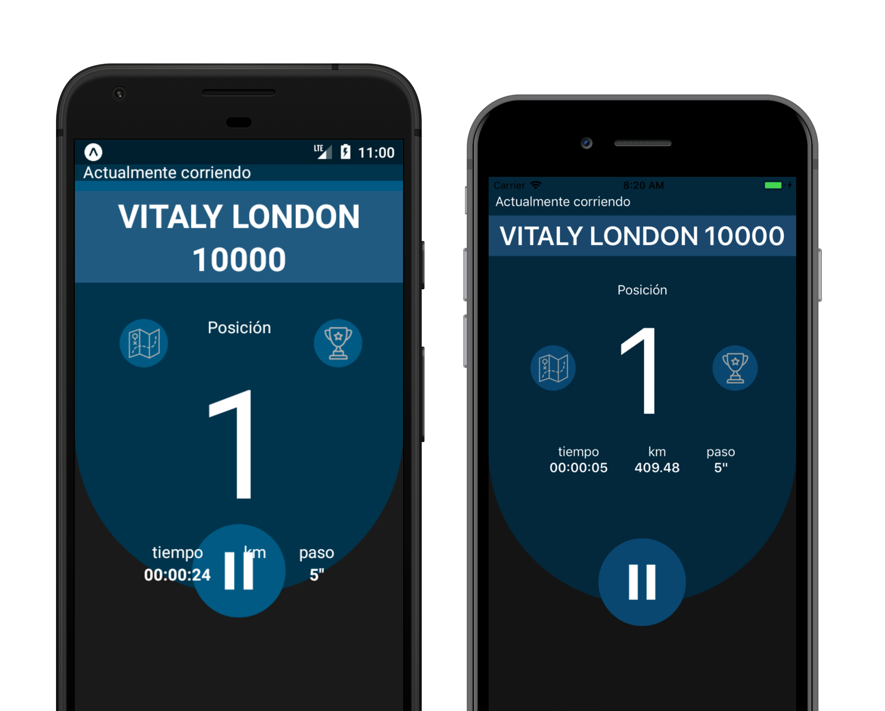

    

# 

Run Forrest es una plataforma que organiza y gestiona carreras virtuales, para que runners de todo el mundo puedan competir entre ellos en tiempo real. Persigue el objetivo de incentivar la práctica del running a través de la competencia y fidelizar a sus usuarios a través de la gamificación del deporte. Fue creada en el contexto de la hackathon [DeporTech de Personal en el Campus Party Buenos Aires 2018](https://campuse.ro/challenges/deportech/).

    

